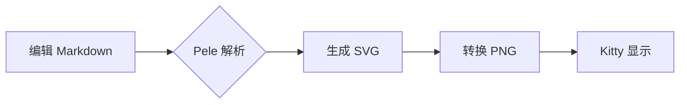
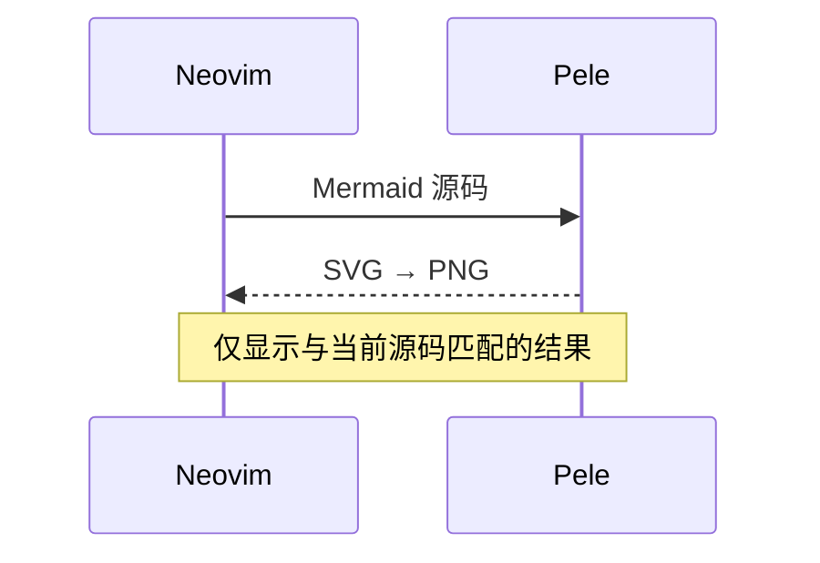

# Siren 验证页

源码保持可编辑。执行 :Siren all 显示行内图片。

```mermaid
flowchart LR
  A[编辑 Markdown] --> B{Pele 解析}
  B --> C[生成 SVG]
  C --> D[转换 PNG]
  D --> E[Kitty 显示]
```

光标放到下面的代码块内，执行 :Siren float。

```mermaid
sequenceDiagram
  participant N as Neovim
  participant P as Pele
  N->>P: Mermaid 源码
  P-->>N: SVG → PNG
  Note over N,P: 仅显示与当前源码匹配的结果
```
